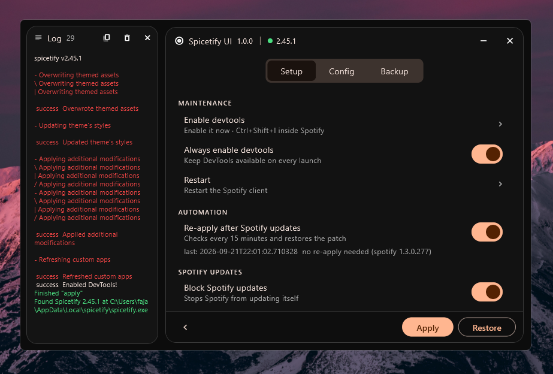

# Spicetify UI

An unofficial desktop front-end for the [Spicetify CLI](https://github.com/spicetify/cli).

Detects your Spicetify install, shows its configuration as a form, runs its
commands, and re-applies the patch after Spotify updates. Not affiliated with
Spicetify or Spotify AB.

## Download

Grab the latest release for your platform. Builds are unsigned, so Windows
SmartScreen and macOS Gatekeeper may warn — choose "Run anyway" / right-click
→ Open once, or build from source below.

## Build

Requires Flutter stable.

    flutter pub get
    flutter test
    flutter build windows --release

## License

MIT. See `NOTICE` for upstream attribution.
